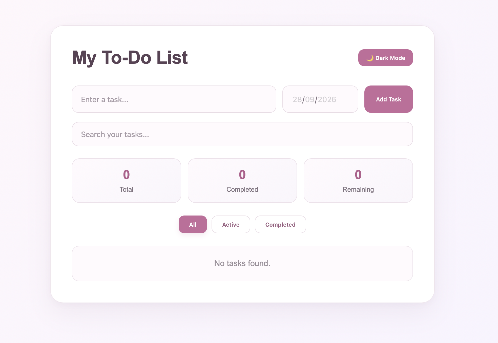
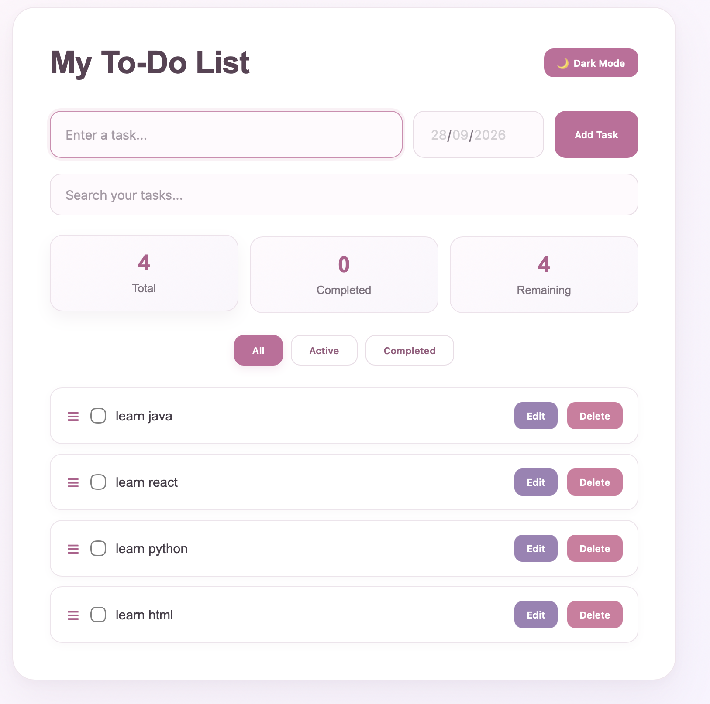
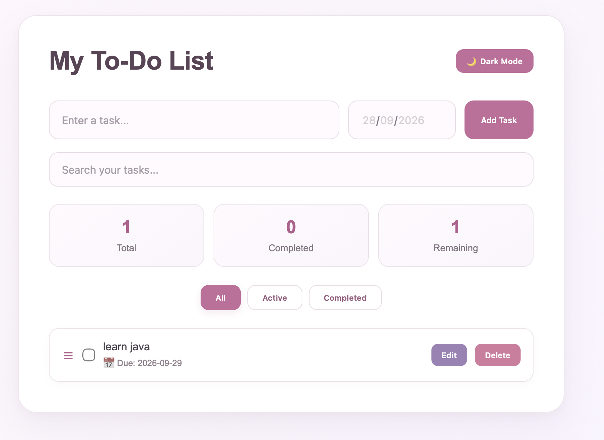
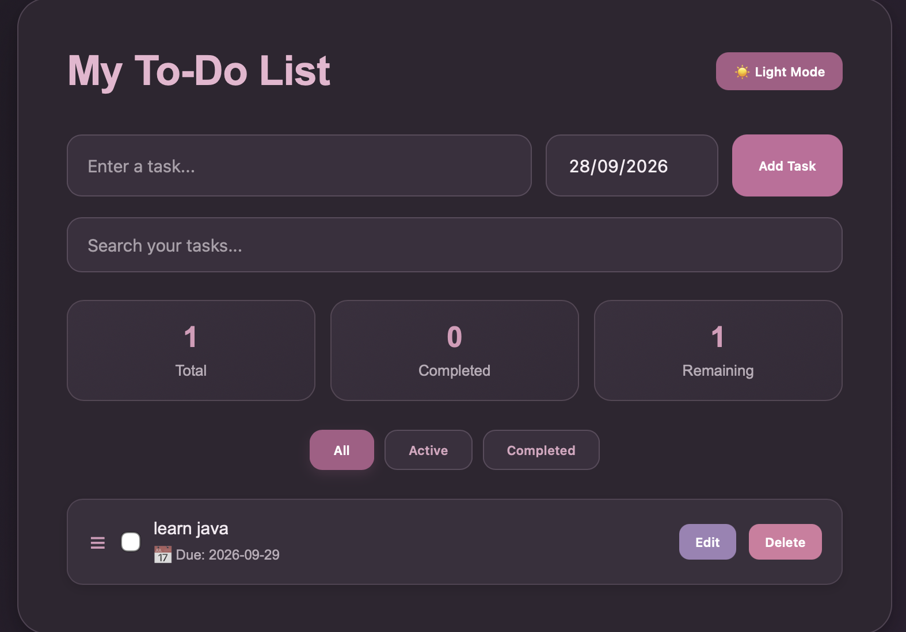

# To-Do List Website

## Project Description

The To-Do List is a simple web application that allows users to manage their daily tasks. Users can add tasks, view their task list, and manage their tasks through an easy-to-use interface.

## Features

* Add new tasks
* Display added tasks
* Mark tasks as completed
* Delete tasks
* Simple and user-friendly interface
* Responsive design for different screen sizes

## Technologies and Libraries Used

* React.js
* JavaScript
* HTML
* CSS
* Vite
* React Hooks

## Setup Instructions

 1. Download the project

Download the project from GitHub and open the project folder in VS Code.

 2. Install dependencies

Open the terminal in the project folder and run:

```bash
npm install
```

3. Start the development server

Run:

```bash
npm run dev
```

The terminal will provide a local URL. Open that URL in your browser to run the application.

## Screenshots

### Main Page



### Task Management



### Due Date and Overdue Task



### Dark Theme




## Known Limitations

* Tasks are saved in the browser only and cannot be accessed on other devices.
* The application does not currently have user login or account functionality.
* No backend database is connected to the application.
